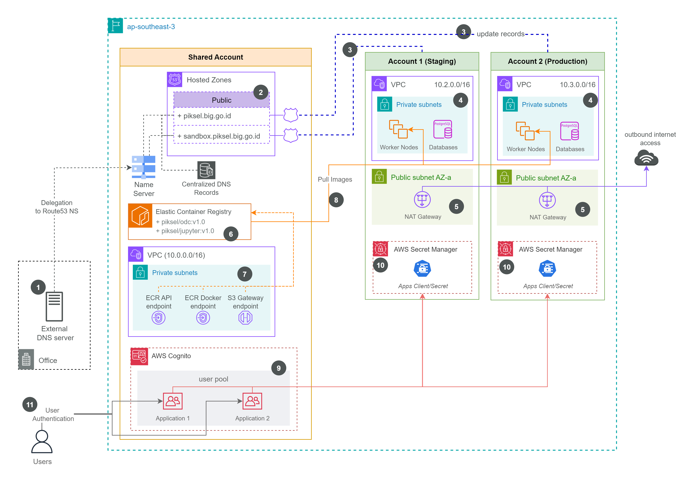

# Piksel Infrastructure (`piksel-infra`)

This repository contains the Infrastructure as Code (IaC) definitions, managed by [Terraform](https://www.terraform.io/), for the Piksel project's AWS infrastructure. It follows GitOps principles for managing deployments across different environments.

## Overview

This repository contains **Terraform configurations** for deploying and managing the **core AWS infrastructure** that supports our Kubernetes-based applications. This infrastructure serves as the foundation layer, while the actual Kubernetes workloads and applications are managed separately through GitOps practices in **[piksel-gitops repo](https://github.com/piksel-ina/piksel-gitops)**.

### Directory Structure

```
├── README.md              # Main project documentation
├── applications/          # Application Configs (Flux CD, Argo Workflows, Grafana, Jupyter-hub, ODC, Terria)
├── aws-database/          # Database infrastructure
├── aws-eks-cluster/       # Amazon EKS cluster configuration
├── aws-s3-bucket/         # S3 bucket resources and policies
├── external-dns/          # External DNS controller configuration
├── karpenter/             # Karpenter node provisioner setup
├── networks/              # VPC, subnets, and networking resources
├── secrets-management/    # Secrets and credential management
└── staging/               # Staging environment specific configurations
```

### Relationship with GitOps

This Terraform repository works in conjunction with our GitOps repository:

**🏗️ Infrastructure Layer (This Repo)**

- Provisions AWS resources using Terraform
- Creates and configures EKS cluster
- Sets up networking, databases, and storage
- Manages infrastructure-level security

**⚙️ Application Layer ([piksel-gitops](https://github.com/piksel-ina/piksel-gitops))**

- Contains Kubernetes manifests and Helm charts
- Manages application deployments via FluxCD
- Handles application configuration and updates
- Manages application-level resources within Kubernetes

### Kubernetes Secrets Management

The **only Kubernetes-specific configurations** in this repository are:

- **Kubernetes Secrets** that integrate with **AWS Secrets Manager**
- Secret synchronization between AWS and Kubernetes

This approach ensures:

- Secrets are centrally managed in AWS
- Kubernetes applications can securely access secrets
- No sensitive data is stored in GitOps repository
- Compliance with security best practices

## Multi-Account Architecture

Our infrastructure is deployed across **multiple AWS accounts** to ensure proper separation of environments, enhanced security, and compliance with best practices.

### Account Structure



1. **Shared Account [Piksel Hub](https://github.com/piksel-ina/piksel-hub)**

   - _Purpose_: Centralized services and shared resources
   - _Region_: ap-southeast-3
   - _VPC CIDR_: 10.0.0.0/16
   - _Key Components_:
     - Route53 Hosted Zones for DNS management
     - Elastic Container Registry (ECR) for container images
     - AWS Cognito User Pool for authentication
     - VPC Endpoints (ECR API, ECR Docker, S3 Gateway)
     - Office connectivity and external DNS delegation

2. **Downstream Accounts (Staging/Production Env - This Repo)**

   - _Purpose_: Development and testing environment
   - _VPC CIDR_: 10.2.0.0/16 & 10.3.0.0/16
   - _Key Components_:
     - EKS Cluster with worker nodes
     - RDS Databases for application data
     - AWS Secrets Manager for staging/production secrets
     - NAT Gateway for outbound internet access
     - Cognito App Client for staging/production applications

### Cross-Account Connectivity

1. **DNS Management Flow**

   - External DNS Server delegates to Route53 NS records
   - Shared Account manages centralized DNS records
   - Route53 updates records across all environments

2. **Container Image Distribution**

   - ECR Repository in Shared Account stores all container images
   - Cross-account IAM policies allow staging/production to pull images
   - VPC Endpoints provide secure, private access to ECR

3. **Authentication Flow**

   - AWS Cognito User Pool centralized in Shared Account
   - App Clients configured per environment (staging/production)
   - User authentication flows through centralized identity provider
   - Cross-account trust relationships for secure access

### Security & Isolation Benefits

1. **Environment Isolation**

   - Complete separation between staging and production
   - Independent billing and cost tracking
   - Separate IAM policies and access controls
   - Isolated network boundaries with different CIDR blocks

2. **Centralized Services**

   - Shared ECR reduces duplication and costs
   - Centralized DNS simplifies domain management
   - Single identity provider for consistent authentication
   - Shared office connectivity for administrative access

3. **Compliance & Governance**

   - Account-level policies for different compliance requirements
   - Separate audit trails per environment
   - Independent backup and disaster recovery strategies
   - Granular access control based on environment needs

## Developer Guide

### 2.1. Terraform - AWS OIDC Setup

> _to be updated_

### 2.2. Add Secret to AWS Secrets Manager

> _to be updated_

### 2.3. AWS Service Quotas for Worker Nodes (Karpenter)

> _to be updated_
> Before running GPU workloads with Karpenter, ensure that the AWS account has sufficient EC2 service quotas for the required GPU instance families. By default, new AWS accounts have a vCPU limit of `0` for GPU instance families (such as G, P, or Inf), which prevents Karpenter from provisioning GPU nodes.

**Requesting GPU Instance Quota Increases:**

Quota increases are required for both On-Demand and Spot vCPUs for each GPU instance family that will be used.

**Steps:**

1. Log in to the AWS Console for the target account and region.
2. Navigate to [Service Quotas > EC2](https://console.aws.amazon.com/servicequotas/home/services/ec2/quotas).
3. Search for the following quotas:
   - **Running On-Demand G and VT instances**
   - **Running On-Demand P instances** (for NVIDIA A100, V100, etc.)
   - **Spot Instance Requests** for all relevant GPU families (e.g., g5, g4dn, p3, p4d).
4. For each relevant quota, select “Request quota increase.”
   - A recommended minimum is 8 vCPUs for both On-Demand and Spot, but this should be adjusted based on anticipated GPU workload requirements.
5. Enter the desired vCPU limit and submit the request.
6. Wait for AWS to approve the quota increase. Approval notifications will be sent via email.

> **Note:**
> If these quota increases are not in place, Karpenter will be unable to provision GPU nodes, and GPU workloads will remain unscheduled.

**References:**

- [AWS EC2 Service Quotas Documentation](https://docs.aws.amazon.com/AWSEC2/latest/UserGuide/ec2-resource-limits.html)
- [Karpenter GPU Node Provisioning Guide](https://karpenter.sh/docs/concepts/instance-types/#gpu-instances)

## Maintainers

This repository is maintained by the **Piksel DevOps Team**.
