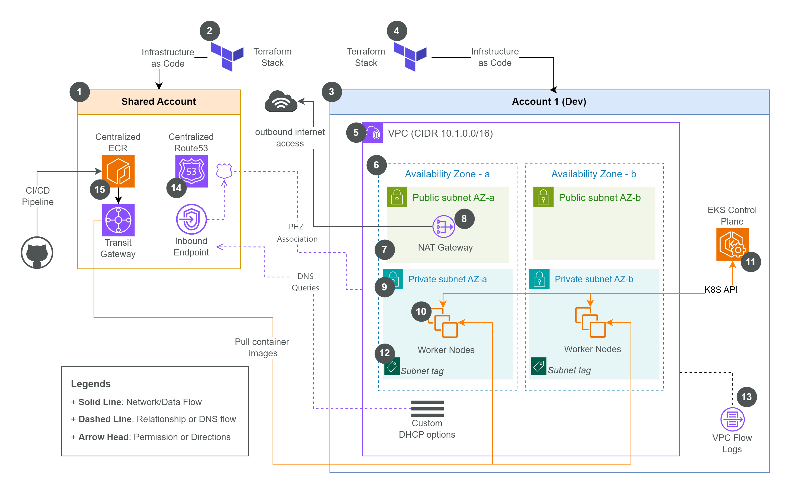
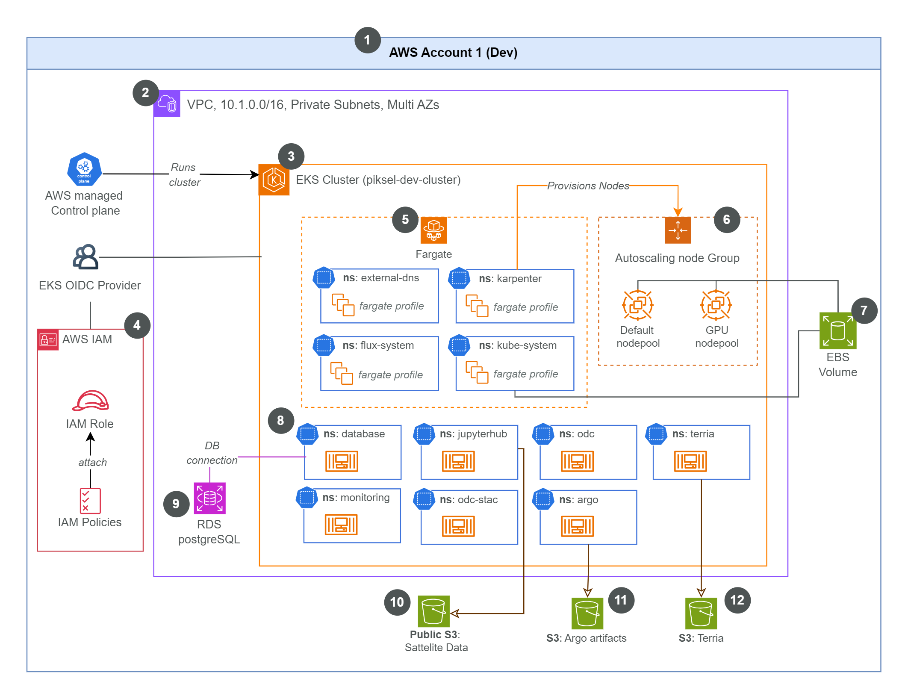

# Piksel Infrastructure (`piksel-infra`)

This repository contains the Infrastructure as Code (IaC) definitions, managed by [Terraform](https://www.terraform.io/), for the Piksel project's AWS infrastructure. It follows GitOps principles for managing deployments across different environments.

## 1. Infrastructure Design

### 1.1. Network

Piksel’s AWS infrastructure uses a hub-and-spoke network architecture, where a central “hub” account manages shared services like DNS, ECR, and network routing, while isolated “spoke” accounts (for environments such as dev, staging, and prod) run workloads. This design leverages AWS Transit Gateway to enable private, secure connectivity between accounts—especially for pulling container images from a centralized ECR—ensuring that traffic stays off the public internet.

**Network Diagram:**



For more details, see:

[**🔗 Piksel Spoke Network Design**](https://github.com/piksel-ina/piksel-document/blob/main/architecture/spoke-network-design.md)

### 1.2. EKS Cluster Design

The Piksel EKS clusters are designed for scalability, security, and efficient operations within the spoke account VPCs. Key design aspects include:

- **Managed Control Plane:** Utilizes AWS EKS for a managed, highly available Kubernetes control plane.
- **Dynamic Node Provisioning:** Employs [Karpenter](https://karpenter.sh/) for efficient, just-in-time provisioning of EC2 nodes based on workload requirements, optimizing for cost and performance.
- **Serverless Compute:** Leverages [AWS Fargate](https://aws.amazon.com/fargate/) profiles for running specific stateless workloads without managing underlying EC2 instances.
- **Secure Pod Permissions:** Implements IAM Roles for Service Accounts (IRSA) to grant fine-grained AWS permissions directly to Kubernetes service accounts.
- **Secrets Management:** Integrates securely with AWS Secrets Manager for managing sensitive information like API keys and database credentials.
- **GitOps Application Deployment:** Cluster state and application deployments are managed declaratively via GitOps tooling (Flux CD) configured in the [piksel-gitops](https://github.com/piksel-ina/piksel-gitops) repository.
- **Provisioning:** The Terraform code within _this repository_ is responsible for provisioning and managing the lifecycle of this EKS cluster design and its core AWS dependencies (VPC, IAM, RDS, S3, etc.).

**EKS Cluster Diagram:**



For a comprehensive overview of the cluster architecture and each component, please refer to:

1. [**EKS Cluster Design**](https://github.com/piksel-ina/piksel-document/blob/main/architecture/eks-cluster-design.md),
2. [**EKS Add-ons Configuration**](https://github.com/piksel-ina/piksel-document/blob/main/architecture/eks-addons.md),
3. [**Karpenter Configuration**](https://github.com/piksel-ina/piksel-document/blob/main/architecture/karpenter.md)

## 2. Developer Guide

### 2.1. Stack OIDC Setup

The Stack OIDC configuration enables secure authentication between Terraform Cloud and AWS using OpenID Connect. This setup supports multi-environment deployments using different local backends/workspaces with the same configuration.

**Prerequisites:**

- Ensure AWS SSO profile matches the target environment where the OIDC role will be created
- Verify you're authenticated to the correct AWS account using `aws sts get-caller-identity`

**Setup Steps for Dev Environment:**

1. **Create and switch to dev workspace:**

   ```bash
   terraform workspace new dev
   ```

2. **Initialize Terraform:**

   ```bash
   terraform init
   ```

3. **Plan and apply the OIDC configuration:**

   ```bash
   terraform plan
   terraform apply
   ```

4. **Verify deployment:**
   ```bash
   terraform output
   ```

**Multi-Environment Support:**

- For **staging**: Create `staging` workspace and repeat the process
- For **production**: Create `prod` workspace and repeat the process
- Each workspace maintains isolated state while using the same configuration

**Important Notes:**

- Ensure your AWS SSO profile corresponds to the target environment
- Each workspace will create environment-specific OIDC resources
- The generated role ARN will be used in Terraform Cloud for workload identity authentication

**Reference:** [Terraform Stacks Authentication Guide](https://developer.hashicorp.com/terraform/language/stacks/deploy/authenticate)

### 2.2. Add Secret to AWS Secrets Manager

1. **Authenticate with AWS SSO**
   If you haven't configure any sso session, please follow this guide - [Configure SSO with Piksel URL](https://github.com/piksel-ina/piksel-document/blob/main/operations/02-AWS-identity-center-guide.md#aws-cli-setup-and-access)

2. **Verify Your AWS Account**
   Before proceeding, ensure you are operating in the correct AWS account:

   ```bash
   aws sts get-caller-identity
   ```

3. **Add the Secret to AWS Secrets Manager**

   _Note: Replace the placeholders (`<...>`) with the actual values._

- Use the following command to create **Slack webhook** secret.
  ```bash
  aws secretsmanager create-secret \
      --name <slack-secret-name> \
      --secret-string <https://hooks.slack.com/services/EXAMPLELONGSTRIN> \
      --description "<Secret description>" \
      --tags \
          Key=Project,Value=<projectname> \
          Key=Service,Value=<servicename> \
          Key=Environment,Value=<env name> \
          Key=Owner,Value=Piksel-Devops-Team \
          Key=Tenant,Value=Slack \
      --region ap-southeast-3
  ```
- As for the OAuth Client Secret (**Grafana, JupyterHub, or Argo Workflow**):
  ```bash
  aws secretsmanager create-secret \
    --name <secret-name> \
    --secret-string <client_id_here>:<client_secret_here> \
    --description "<description>" \
    --tags \
      Key=Project,Value=<projectname> \
      Key=Service,Value=<servicename> \
      Key=Environment,Value=<env name> \
      Key=Owner,Value=Piksel-Devops-Team \
      Key=Tenant,Value=Auth0 \
    --region ap-southeast-3
  ```

### 2.3. AWS Service Quotas for GPU Nodes (Karpenter)

Before running GPU workloads with Karpenter, ensure that the AWS account has sufficient EC2 service quotas for the required GPU instance families. By default, new AWS accounts have a vCPU limit of `0` for GPU instance families (such as G, P, or Inf), which prevents Karpenter from provisioning GPU nodes.

**Requesting GPU Instance Quota Increases:**

Quota increases are required for both On-Demand and Spot vCPUs for each GPU instance family that will be used.

**Steps:**

1. Log in to the AWS Console for the target account and region.
2. Navigate to [Service Quotas > EC2](https://console.aws.amazon.com/servicequotas/home/services/ec2/quotas).
3. Search for the following quotas:
   - **Running On-Demand G and VT instances**
   - **Running On-Demand P instances** (for NVIDIA A100, V100, etc.)
   - **Spot Instance Requests** for all relevant GPU families (e.g., g5, g4dn, p3, p4d).
4. For each relevant quota, select “Request quota increase.”
   - A recommended minimum is 8 vCPUs for both On-Demand and Spot, but this should be adjusted based on anticipated GPU workload requirements.
5. Enter the desired vCPU limit and submit the request.
6. Wait for AWS to approve the quota increase. Approval notifications will be sent via email.

> **Note:**
> If these quota increases are not in place, Karpenter will be unable to provision GPU nodes, and GPU workloads will remain unscheduled.

**References:**

- [AWS EC2 Service Quotas Documentation](https://docs.aws.amazon.com/AWSEC2/latest/UserGuide/ec2-resource-limits.html)
- [Karpenter GPU Node Provisioning Guide](https://karpenter.sh/docs/concepts/instance-types/#gpu-instances)

## Maintainers

This repository is maintained by the **Piksel DevOps Team**.
