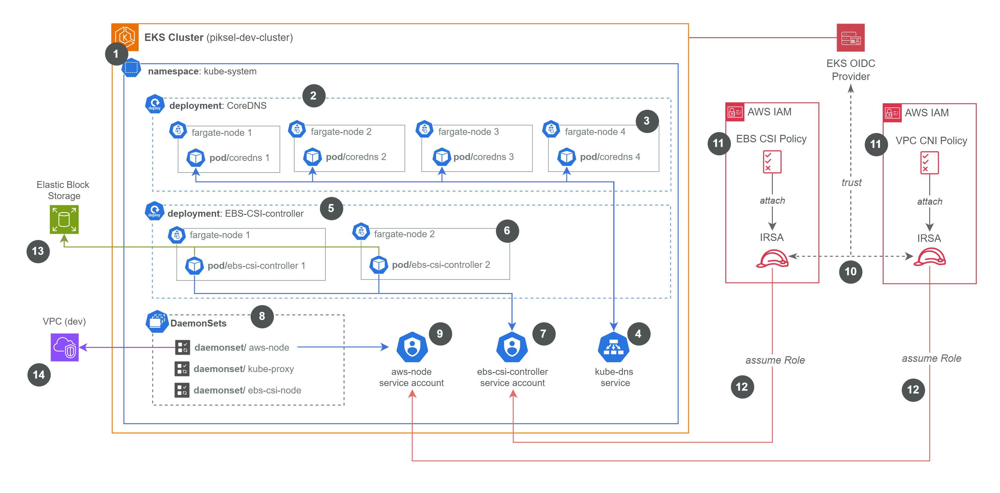

## EKS Cluster Configuration

This Terraform configuration sets up an AWS EKS (Elastic Kubernetes Service) cluster using the `terraform-aws-modules/eks/aws` module. It includes specific configurations for core components, compute types, and access management.

## Key Features

- EKS Cluster Creation: Deploys an EKS cluster with a specified version and public endpoint access.
- IAM Roles for Service Accounts (IRSA):
  - Configures dedicated IAM roles for:
    - ebs-csi-controller-sa (in kube-system) with the AmazonEBSCSIDriverPolicy.
    - aws-node (VPC CNI, in kube-system) with the AmazonEKS_CNI_Policy.
  - These roles allow the respective Kubernetes service accounts to securely interact with AWS APIs.
- Managed EKS Add-ons: Installs and configures essential add-ons:
  - CoreDNS: Deployed onto Fargate with specified resource requests/limits and autoscaling enabled (min 4, max 10 replicas).
  - Kube-Proxy: Standard deployment.
  - VPC CNI: Configured to use the dedicated IRSA role created above.
  - AWS EBS CSI Driver: Configured to use the dedicated IRSA role created above. Set to use the most recent version and overwrite conflicts.
- Fargate Profiles: Configures AWS Fargate as the compute type for Pods in the following namespaces:
  - kube-system
  - karpenter
  - flux-system
  - aws-external-dns-helm
- Networking: Uses provided VPC ID and private subnet IDs. Does _not_ create additional cluster or node security groups, relying on Fargate profile security groups.
- Access Management:
  - Enables cluster creator admin permissions.
  - Utilizes EKS Access Entries to grant AmazonEKSClusterAdminPolicy cluster-wide access to a specified Admin Role ARN (var.sso-admin-role-arn).
- Tagging: Applies default tags and a specific `karpenter.sh/discovery` tag for Karpenter integration.

## Architecture Diagram

This diagram illustrates the key components within the `kube-system` namespace of the EKS cluster and their interaction with AWS services, particularly focusing on DNS, storage, networking, and permissions.

&nbsp; <figure>

<figcaption><i>Figure: kube-system configuration diagram</i></figcaption>

</figure>

### Explanation:

1.  **EKS Cluster:** The overall Kubernetes control plane and worker node environment managed by AWS EKS. All subsequent components reside within or interact with this cluster.
2.  **CoreDNS Deployment:** A Kubernetes Deployment managing the lifecycle of CoreDNS pods, ensuring the desired number of replicas are running for cluster DNS resolution.
3.  **CoreDNS Pods (on Fargate):** Instances of CoreDNS running on AWS Fargate. These pods handle DNS lookups for services and pods within the cluster. Fargate provides serverless compute, removing the need to manage underlying EC2 instances for these pods.
4.  **kube-dns Service:** A Kubernetes Service providing a stable IP address and DNS name for accessing the CoreDNS pods (2, 3). Pods within the cluster use this service endpoint for DNS queries.
5.  **EBS-CSI-controller Deployment:** A Kubernetes Deployment managing the pods responsible for interacting with the AWS EBS API to provision, attach, detach, and manage the lifecycle of Persistent Volumes.
6.  **EBS-CSI-controller Pods (on Fargate):** Instances of the EBS CSI controller running on AWS Fargate. These pods execute the control plane logic for managing EBS volumes on behalf of the cluster.
7.  **ebs-csi-controller Service Account:** A Kubernetes Service Account providing an identity for the EBS CSI controller pods (6). This identity is linked via IRSA (10) to an AWS IAM Role.
8.  **DaemonSets:** Kubernetes DaemonSets ensuring that specific pods run on relevant nodes (or are managed appropriately in a Fargate context).
    - `aws-node`: Pods for the AWS VPC CNI plugin, responsible for pod networking and IP address management within the VPC (14).
    - `kube-proxy`: Pods managing Kubernetes service routing rules (iptables/ipvs) on each node.
    - `ebs-csi-node`: Pods responsible for node-specific EBS operations like mounting volumes (works in conjunction with the controller).
9.  **aws-node Service Account:** A Kubernetes Service Account providing an identity for the `aws-node` pods (part of 8). This identity is linked via IRSA (10) to an AWS IAM Role.
10. **IRSA (IAM Roles for Service Accounts):** The mechanism connecting Kubernetes Service Accounts (7, 9) to AWS IAM Roles. The EKS OIDC provider acts as a trusted identity provider for AWS IAM, allowing it to validate tokens issued to the Service Accounts.
11. **AWS IAM Policies:** Specific IAM policies (EBS CSI Policy, VPC CNI Policy) defining the exact permissions required by the respective components (EBS CSI controller, VPC CNI plugin) to interact with AWS services (EBS, EC2/VPC). These policies are attached to the IAM Roles used by IRSA (10).
12. **Assume Role:** The AWS STS action performed by the pods (6 and pods from 8 associated with 9), using the token from their Service Account (7, 9). This action exchanges the K8s token for temporary AWS credentials associated with the IAM Role (linked via 10), granting the permissions defined in the attached Policies (11).
13. **Elastic Block Storage (EBS):** The AWS service providing persistent block storage volumes. The EBS CSI controller pods (6) interact with this service via the AWS API (using credentials obtained via 12) to manage volumes for the cluster.
14. **VPC (Virtual Private Cloud):** The AWS networking environment where the EKS cluster and its resources reside. The `aws-node` pods (from 8, using identity 9 and permissions via 10, 11, 12) interact with the VPC to manage IP allocation for pods.

## Documentation

For more detailed documentation, please refer to this documents:

- [AWS EKS CLuster Overview](https://github.com/piksel-ina/piksel-document/blob/main/architecture/eks-cluster-design.md)
- [EKS Add-ons](https://github.com/piksel-ina/piksel-document/blob/main/architecture/eks-addons.md)

<!-- BEGIN_TF_DOCS -->

## Requirements

No requirements.

## Providers

| Name                                             | Version |
| ------------------------------------------------ | ------- |
|  [aws](#provider_aws) | n/a     |

## Modules

| Name                                                                                   | Source                                                                   | Version  |
| -------------------------------------------------------------------------------------- | ------------------------------------------------------------------------ | -------- |
|  [ebs_csi_irsa_role](#module_ebs_csi_irsa_role) | terraform-aws-modules/iam/aws//modules/iam-role-for-service-accounts-eks | 5.55.0   |
|  [eks](#module_eks)                                           | terraform-aws-modules/eks/aws                                            | ~> 20.33 |
|  [vpc_cni_irsa_role](#module_vpc_cni_irsa_role) | terraform-aws-modules/iam/aws//modules/iam-role-for-service-accounts-eks | 5.55.0   |

## Resources

| Name                                                                                                                         | Type        |
| ---------------------------------------------------------------------------------------------------------------------------- | ----------- |
| [aws_eks_cluster_auth.this](https://registry.terraform.io/providers/hashicorp/aws/latest/docs/data-sources/eks_cluster_auth) | data source |

## Inputs

| Name                                                                                       | Description                                    | Type           | Default                | Required |
| ------------------------------------------------------------------------------------------ | ---------------------------------------------- | -------------- | ---------------------- | :------: |
|  [cluster_name](#input_cluster_name)                      | Name of the EKS cluster for tagging subnets    | `string`       | `"piksel-eks-cluster"` |    no    |
|  [coredns-version](#input_coredns-version)             | The version of CoreDNS for this environment    | `string`       | n/a                    |   yes    |
|  [default_tags](#input_default_tags)                      | Default tags to apply to all resources         | `map(string)`  | `{}`                   |    no    |
|  [eks-version](#input_eks-version)                         | The version of Kubernetes for this environment | `string`       | n/a                    |   yes    |
|  [kube-proxy-version](#input_kube-proxy-version)    | The version of kube-proxy for this environment | `string`       | n/a                    |   yes    |
|  [private_subnets_ids](#input_private_subnets_ids) | List of private subnets ID                     | `list(string)` | n/a                    |   yes    |
|  [sso-admin-role-arn](#input_sso-admin-role-arn)    | The ARN of SSO Admin group                     | `string`       | n/a                    |   yes    |
|  [vpc-cni-version](#input_vpc-cni-version)             | The version of VPC CNI for this environment    | `string`       | n/a                    |   yes    |
|  [vpc_id](#input_vpc_id)                                        | VPC ID value                                   | `string`       | n/a                    |   yes    |

## Outputs

| Name                                                                                                                                                        | Description                                   |
| ----------------------------------------------------------------------------------------------------------------------------------------------------------- | --------------------------------------------- |
|  [authentication_token](#output_authentication_token)                                                             | Token to use to authenticate with the cluster |
|  [cluster_certificate_authority_data](#output_cluster_certificate_authority_data)                   | EKS Cluster Certificate Authority Data        |
|  [cluster_endpoint](#output_cluster_endpoint)                                                                         | EKS Cluster Endpoint                          |
|  [cluster_name](#output_cluster_name)                                                                                     | EKS Cluster Name                              |
|  [cluster_oidc_issuer_url](#output_cluster_oidc_issuer_url)                                                    | EKS Cluster OIDC Issuer URL                   |
|  [cluster_oidc_provider_arn](#output_cluster_oidc_provider_arn)                                              | EKS Cluster OIDC Provider ARN                 |
|  [cluster_tls_certificate_sha1_fingerprint](#output_cluster_tls_certificate_sha1_fingerprint) | EKS Cluster TLS Certificate SHA1 Fingerprint  |

<!-- END_TF_DOCS -->
