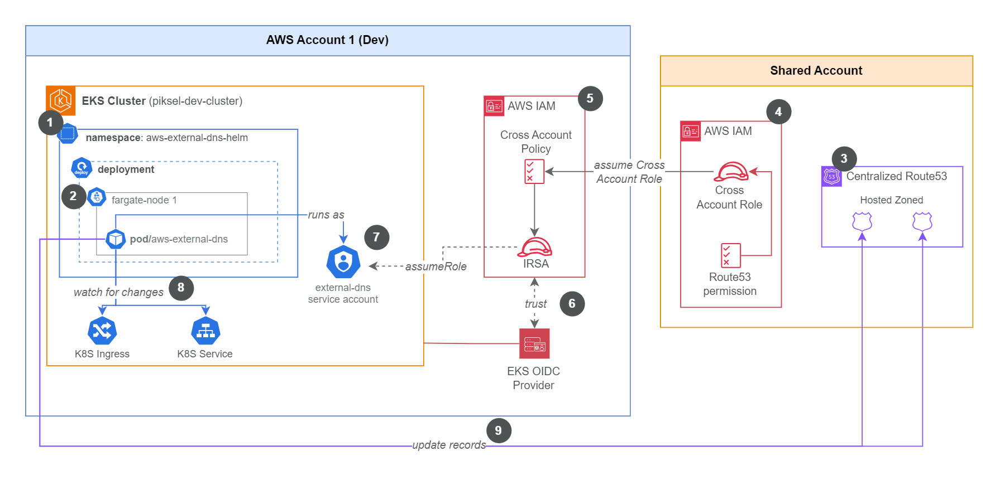

# ExternalDNS and FluxCD Notification Setup for EKS

This Terraform module configures and deploys ExternalDNS to an AWS EKS cluster. It also includes resources for setting up FluxCD Slack notifications.

## Overview

This module automates the following:

1.  **ExternalDNS Deployment**:

    - Creates a dedicated Kubernetes namespace (`aws-external-dns-helm`).
    - Sets up an IAM Role for Service Account (IRSA) for ExternalDNS pods. This role is granted permissions to:
      - List Route53 hosted zones and record sets.
      - Change resource record sets in specific, pre-configured hosted zones.
      - Assume a cross-account IAM role located in a shared AWS account for managing DNS records.
    - Deploys ExternalDNS using the official Helm chart, configured to:
      - Use the created service account with IRSA.
      - Assume the specified cross-account IAM role for Route53 operations.
      - Monitor services and ingresses to synchronize DNS records.

&nbsp;<figure>

  <figcaption><i>Figure: ExternalDNS configuration diagram for piksel eks cluster</i></figcaption>
</figure>

For more comprehensive explanation please refer to [**📑 ExternalDNS Detail Documentation**](https://github.com/piksel-ina/piksel-document/blob/main/architecture/eks-addons.md)

<!-- BEGIN_TF_DOCS -->
## Requirements

No requirements.

## Providers

| Name | Version |
|------|---------|
|  [aws](#provider\_aws) | n/a |
|  [helm](#provider\_helm) | n/a |
|  [kubernetes](#provider\_kubernetes) | n/a |

## Modules

No modules.

## Resources

| Name | Type |
|------|------|
| [aws_iam_role.external_dns](https://registry.terraform.io/providers/hashicorp/aws/latest/docs/resources/iam_role) | resource |
| [aws_iam_role_policy.external_dns](https://registry.terraform.io/providers/hashicorp/aws/latest/docs/resources/iam_role_policy) | resource |
| [helm_release.external_dns](https://registry.terraform.io/providers/hashicorp/helm/latest/docs/resources/release) | resource |
| [kubernetes_namespace.external_dns](https://registry.terraform.io/providers/hashicorp/kubernetes/latest/docs/resources/namespace) | resource |
| [kubernetes_namespace.flux_system](https://registry.terraform.io/providers/hashicorp/kubernetes/latest/docs/resources/namespace) | resource |
| [kubernetes_secret.slack_webhook](https://registry.terraform.io/providers/hashicorp/kubernetes/latest/docs/resources/secret) | resource |
| [aws_iam_policy_document.external_dns](https://registry.terraform.io/providers/hashicorp/aws/latest/docs/data-sources/iam_policy_document) | data source |
| [aws_secretsmanager_secret_version.slack_webhook](https://registry.terraform.io/providers/hashicorp/aws/latest/docs/data-sources/secretsmanager_secret_version) | data source |

## Inputs

| Name | Description | Type | Default | Required |
|------|-------------|------|---------|:--------:|
|  [aws\_partition](#input\_aws\_partition) | The AWS partition | `string` | `"aws"` | no |
|  [aws\_region](#input\_aws\_region) | AWS region | `string` | n/a | yes |
|  [cluster\_name](#input\_cluster\_name) | Name of the EKS cluster | `string` | n/a | yes |
|  [default\_tags](#input\_default\_tags) | Default tags | `any` | n/a | yes |
|  [environment](#input\_environment) | The name of the environment | `string` | n/a | yes |
|  [externaldns\_crossaccount\_role\_arn](#input\_externaldns\_crossaccount\_role\_arn) | The ARN of the cross-account IAM role in Route53 account | `string` | n/a | yes |
|  [oidc\_provider](#input\_oidc\_provider) | EKS Cluster OIDC provider issuer | `any` | n/a | yes |
|  [oidc\_provider\_arn](#input\_oidc\_provider\_arn) | EKS Cluster OIDC provider arn | `any` | n/a | yes |
|  [project](#input\_project) | The name of the project | `string` | n/a | yes |
|  [public\_hosted\_zone\_id](#input\_public\_hosted\_zone\_id) | The ID of the public hosted zone | `string` | n/a | yes |
|  [subdomains](#input\_subdomains) | List of domain filters for ExternalDNS | `list(string)` | n/a | yes |
|  [zone\_ids](#input\_zone\_ids) | Map of domain name to Route53 hosted zone IDs | `any` | n/a | yes |

## Outputs

| Name | Description |
|------|-------------|
|  [external\_dns\_helm\_chart\_version](#output\_external\_dns\_helm\_chart\_version) | Version of the External DNS Helm chart deployed |
|  [external\_dns\_helm\_release\_name](#output\_external\_dns\_helm\_release\_name) | Name of the Helm release for External DNS |
|  [external\_dns\_helm\_release\_namespace](#output\_external\_dns\_helm\_release\_namespace) | Namespace of the Helm release for External DNS |
|  [external\_dns\_helm\_release\_status](#output\_external\_dns\_helm\_release\_status) | Status of the Helm release for External DNS |
|  [external\_dns\_iam\_role\_arn](#output\_external\_dns\_iam\_role\_arn) | ARN of the IAM role created for External DNS |
|  [external\_dns\_namespace](#output\_external\_dns\_namespace) | Namespace where External DNS is deployed |
|  [external\_dns\_service\_account\_name](#output\_external\_dns\_service\_account\_name) | Name of the service account used by External DNS (managed by Helm) |
|  [flux\_namespace](#output\_flux\_namespace) | The namespace where Flux is deployed |
|  [slack\_webhook\_address](#output\_slack\_webhook\_address) | The Slack webhook address used for notifications |
|  [slack\_webhook\_secret\_name](#output\_slack\_webhook\_secret\_name) | Slack webhook secret name |
<!-- END_TF_DOCS -->
