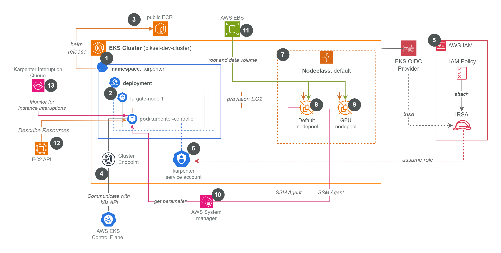

# Karpenter Terraform Configuration for EKS

This directory contains the Terraform configuration for deploying and managing Karpenter on an AWS EKS cluster. Karpenter provides dynamic, just-in-time node provisioning to meet application demands.

&nbsp;<figure>

  <figcaption><i>Figure: Karpenter configuration diagram for piksel-dev-cluster</i></figcaption>
</figure>

For more comprehensive documentation please refer to [**📑 Karpenter Configuration**](https://github.com/piksel-ina/piksel-document/blob/main/architecture/karpenter.md)

## 1. Purpose

This Terraform setup automates the installation and configuration of Karpenter, including:

- Required AWS IAM roles and policies for the Karpenter controller and the nodes it provisions.
- An SQS queue for EC2 instance interruption handling.
- Deployment of the Karpenter controller into the EKS cluster via its Helm chart.
- Creation of Karpenter `EC2NodeClass` and `NodePool` custom resources within Kubernetes to define node provisioning behavior.

## 2. Core Resources Managed by Terraform

This configuration will create and manage the following key resources:

- **IAM Role for Karpenter Controller (`module.karpenter.iam_role_arn`):**
  - Assumed by the Karpenter controller pods via IRSA.
  - Grants permissions for EC2 (describe, run/terminate instances), SQS (read interruption queue), and SSM (get parameters for AMIs).
- **IAM Role for Karpenter Nodes (`module.karpenter.node_iam_role_name`):**
  - Assigned as the EC2 instance profile for nodes launched by Karpenter.
  - Includes policies like `AmazonEKSWorkerNodePolicy`, `AmazonEC2ContainerRegistryReadOnly`, `AmazonSSMManagedInstanceCore`, `AmazonEBSCSIDriverPolicy`, and `AmazonEKS_CNI_Policy`.
- **SQS Queue for Interruption Handling (`module.karpenter.queue_name`):**
  - Used by Karpenter to receive notifications about EC2 instance interruptions (e.g., Spot termination).
- **Helm Release for Karpenter (`helm_release.karpenter`):**
  - Deploys the Karpenter controller into the `karpenter` namespace.
  - Configured with the cluster endpoint, service account, and interruption queue name.
- **Kubernetes Manifest for `EC2NodeClass` (`kubernetes_manifest.karpenter_node_class`):**
  - Named `default`.
  - Defines AWS-specific node configurations:
    - `amiFamily`: `AL2023` (e.g., `al2023@v20250505`)
    - `role`: Points to the Node IAM Role created above.
    - `subnetSelector`: Based on tags (`karpenter.sh/discovery = var.cluster_name`).
    - `securityGroupSelector`: Based on tags (`karpenter.sh/discovery = var.cluster_name`).
    - `blockDeviceMappings`: Configures the root EBS volume (120Gi, gp3, encrypted).
- **Kubernetes Manifests for `NodePools`:**
  _ **`default` NodePool (`kubernetes_manifest.karpenter_node_pool`):**
  _ References the `default` `EC2NodeClass`.
  _ Specifies allowed instance types (categories `c, m, r, t`), CPU limits, and consolidation policies (`WhenEmpty`).
  _ **`gpu` NodePool (`kubernetes_manifest.karpenter_node_pool_gpu`):**
  _ References the `default` `EC2NodeClass`.
  _ Specifies GPU instance types (`g5.xlarge`, etc.).
  _ Applies `nvidia.com/gpu=true:NoSchedule` taint.
  _ Defines GPU limits and consolidation policies.

## 3. How It Works (Brief Overview)

1.  The Karpenter controller, running in a pod within the `karpenter` namespace, uses its IAM role (via IRSA) to interact with AWS services.
2.  It watches for unschedulable pods in the EKS cluster.
3.  Based on pod requirements and the configurations defined in `NodePools` and the `EC2NodeClass`, Karpenter makes decisions to launch new EC2 instances.
4.  It selects appropriate instance types, subnets, and security groups as defined.
5.  It monitors an SQS queue for EC2 instance interruption events and handles them by cordoning, draining, and terminating affected nodes, then launching replacements.
6.  Consolidation policies in `NodePools` help optimize cluster utilization by removing empty or underutilized nodes.

<!-- BEGIN_TF_DOCS -->
## Requirements

| Name | Version |
|------|---------|
|  [kubectl](#requirement\_kubectl) | >= 1.7.0 |

## Providers

| Name | Version |
|------|---------|
|  [aws](#provider\_aws) | n/a |
|  [helm](#provider\_helm) | n/a |
|  [kubectl](#provider\_kubectl) | >= 1.7.0 |
|  [time](#provider\_time) | n/a |

## Modules

| Name | Source | Version |
|------|--------|---------|
|  [karpenter](#module\_karpenter) | terraform-aws-modules/eks/aws//modules/karpenter | ~> 20.33 |

## Resources

| Name | Type |
|------|------|
| [aws_iam_role_policy.karpenter_node_ecr_cross_account](https://registry.terraform.io/providers/hashicorp/aws/latest/docs/resources/iam_role_policy) | resource |
| [helm_release.karpenter](https://registry.terraform.io/providers/hashicorp/helm/latest/docs/resources/release) | resource |
| [kubectl_manifest.karpenter_gpu_node_class](https://registry.terraform.io/providers/gavinbunney/kubectl/latest/docs/resources/manifest) | resource |
| [kubectl_manifest.karpenter_node_class](https://registry.terraform.io/providers/gavinbunney/kubectl/latest/docs/resources/manifest) | resource |
| [kubectl_manifest.karpenter_node_class_data_production](https://registry.terraform.io/providers/gavinbunney/kubectl/latest/docs/resources/manifest) | resource |
| [kubectl_manifest.karpenter_node_class_develop_jupyter](https://registry.terraform.io/providers/gavinbunney/kubectl/latest/docs/resources/manifest) | resource |
| [kubectl_manifest.karpenter_node_class_jupyter](https://registry.terraform.io/providers/gavinbunney/kubectl/latest/docs/resources/manifest) | resource |
| [kubectl_manifest.karpenter_node_pool](https://registry.terraform.io/providers/gavinbunney/kubectl/latest/docs/resources/manifest) | resource |
| [kubectl_manifest.karpenter_node_pool_data_production_r_4xlarge](https://registry.terraform.io/providers/gavinbunney/kubectl/latest/docs/resources/manifest) | resource |
| [kubectl_manifest.karpenter_node_pool_data_production_r_8xlarge](https://registry.terraform.io/providers/gavinbunney/kubectl/latest/docs/resources/manifest) | resource |
| [kubectl_manifest.karpenter_node_pool_develop_jupyter_medium](https://registry.terraform.io/providers/gavinbunney/kubectl/latest/docs/resources/manifest) | resource |
| [kubectl_manifest.karpenter_node_pool_gpu](https://registry.terraform.io/providers/gavinbunney/kubectl/latest/docs/resources/manifest) | resource |
| [kubectl_manifest.karpenter_node_pool_jupyter_large](https://registry.terraform.io/providers/gavinbunney/kubectl/latest/docs/resources/manifest) | resource |
| [kubectl_manifest.karpenter_node_pool_jupyter_standard](https://registry.terraform.io/providers/gavinbunney/kubectl/latest/docs/resources/manifest) | resource |
| [time_sleep.wait_for_karpenter](https://registry.terraform.io/providers/hashicorp/time/latest/docs/resources/sleep) | resource |

## Inputs

| Name | Description | Type | Default | Required |
|------|-------------|------|---------|:--------:|
|  [cluster\_endpoint](#input\_cluster\_endpoint) | value | `any` | n/a | yes |
|  [cluster\_name](#input\_cluster\_name) | Name of EKS Cluster | `any` | n/a | yes |
|  [default\_nodepool\_ami\_alias](#input\_default\_nodepool\_ami\_alias) | AMI alias for default node pools | `string` | `"al2023@v20250505"` | no |
|  [default\_nodepool\_node\_limit](#input\_default\_nodepool\_node\_limit) | Default node limit for node pools | `number` | `10000` | no |
|  [default\_tags](#input\_default\_tags) | value | `map` | `{}` | no |
|  [gpu\_nodepool\_ami](#input\_gpu\_nodepool\_ami) | AMI for GPU node pools | `string` | `"amazon-eks-node-al2023-x86_64-nvidia-1.32-v20250505"` | no |
|  [gpu\_nodepool\_node\_limit](#input\_gpu\_nodepool\_node\_limit) | Default GPU node limit for GPU node pools | `number` | `20` | no |
|  [oidc\_provider\_arn](#input\_oidc\_provider\_arn) | value | `any` | n/a | yes |

## Outputs

| Name | Description |
|------|-------------|
|  [karpenter\_helm\_release\_status](#output\_karpenter\_helm\_release\_status) | The status of the Karpenter Helm release |
|  [karpenter\_iam\_role\_arn](#output\_karpenter\_iam\_role\_arn) | The ARN of the Karpenter IAM role |
|  [karpenter\_interruption\_queue\_name](#output\_karpenter\_interruption\_queue\_name) | The name of the Karpenter interruption SQS queue |
|  [karpenter\_node\_class\_gpu\_status](#output\_karpenter\_node\_class\_gpu\_status) | Status of the Karpenter GPU NodePool. |
|  [karpenter\_node\_class\_status](#output\_karpenter\_node\_class\_status) | Status of the Karpenter EC2NodeClass. |
|  [karpenter\_node\_iam\_role\_name](#output\_karpenter\_node\_iam\_role\_name) | The name of the Karpenter node IAM role |
|  [karpenter\_node\_pool\_gpu\_name](#output\_karpenter\_node\_pool\_gpu\_name) | The name of the GPU Karpenter NodePool. |
|  [karpenter\_node\_pool\_name](#output\_karpenter\_node\_pool\_name) | The name of the default Karpenter NodePool. |
<!-- END_TF_DOCS -->
